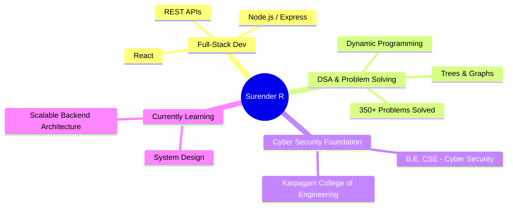
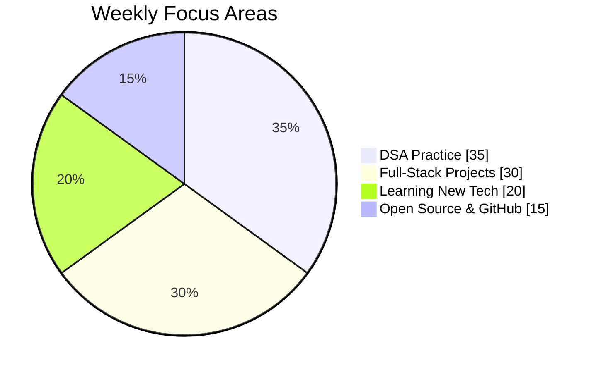
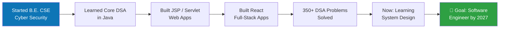
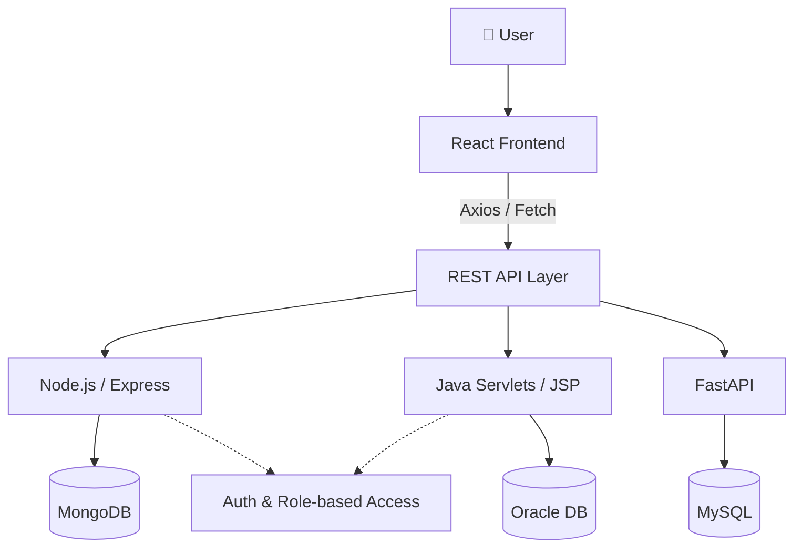
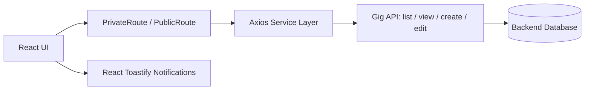
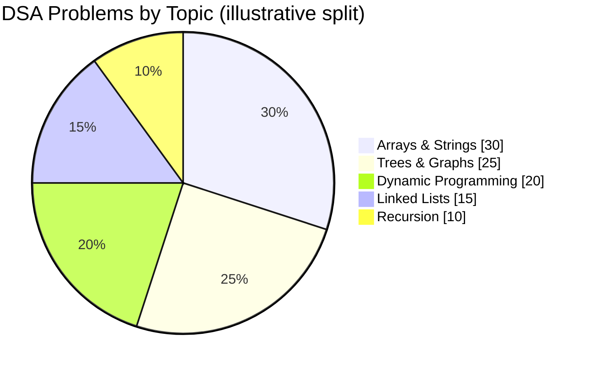

<h1 align="center">Hi there, I'm Surender 👋</h1>
<h3 align="center">Full-Stack Developer | Java & DSA Enthusiast | Cyber Security Undergrad</h3>

<p align="center">
  
  
  
</p>

<p align="center">
  <a href="https://github.com/Surane123" target="_blank">
    
  </a>
  <a href="https://www.linkedin.com/in/surender-rathakrishnan" target="_blank">
    
  </a>
  <a href="mailto:surender444566@gmail.com">
    
  </a>
</p>

---

## 🚀 About Me

- 🎓 B.E. Computer Science Engineering (Cyber Security) @ Karpagam College of Engineering — *Expected 2027*
- 💻 Building full-stack web apps with **React, Node.js, Java (JSP/Servlets/JDBC), and FastAPI**
- 🧠 Solved **350+ DSA problems** across arrays, trees, graphs, and dynamic programming
- 🌱 Currently exploring **system design** and scalable backend architecture
- 📍 Based in Coimbatore, India
- ⚡ Fun fact: *"First solve the problem. Then write the code."*

### 🧩 Mind Map



### 🥧 Where My Time Goes
*(approximate split — feel free to tune these numbers to your own routine)*



### 🗺️ My Journey So Far



---

## 🛠️ Tech Stack

**Languages**


**Frontend**


**Backend**


**Databases & Tools**


### 📊 Skill Proficiency
*(self-rated — adjust to match your own confidence level)*

```text
Java            ████████████████░░░░  80%
JavaScript/React████████████░░░░░░░░  65%
SQL / Databases ██████████████░░░░░░  70%
Python/FastAPI  ███████████░░░░░░░░░  55%
DSA & Algorithms████████████████░░░░  80%
System Design   ████████░░░░░░░░░░░░  40%
```

### 🔗 How My Stack Connects



---

## 🌟 Featured Projects

#### 🛒 Moralancer — Freelancer Marketplace
*React · Axios · React Router · Node/REST API*

A full-stack freelancer marketplace with authentication, protected/private routing, and role-based access. Includes modular pages for services, profiles, messages, and gigs, plus full auth workflows (login/register/reset/activate) and gig CRUD via Axios-integrated REST APIs. Route guards (`PrivateRoute`, `PublicRoute`) and React Toastify notifications round out the UX.



🔗 [View on GitHub](https://github.com/Surane123)

#### 🏟️ Sports Ground Booking System
*Java · JSP · Servlets · JDBC · Oracle*

A Java web application for managing sports ground reservations, with booking creation and listing workflows built on JSP/Servlets and JDBC. Structured with modular source folders and deployment-ready build output for maintainability.

🔗 [View Repository](https://github.com/Surane123/sports-ground-booking)

#### 📚 Student Companion App
*FastAPI · Python · HTML Templates*

A productivity-focused student platform with notes, tasks, study sessions, and mood tracking — featuring API-backed keyword extraction and sentiment analysis to support smarter academic planning. Built with both a web UI and extensible backend endpoints.

🔗 [View Repository](https://github.com/Surane123/student_companion_app)

#### 🌦️ Weather API Project
*JavaScript · HTML · CSS · REST API*

A real-time weather application consuming external weather APIs, displaying live temperature, humidity, and conditions with dynamic UI updates, plus robust API request handling and error states.

🔗 [View on GitHub](https://github.com/Surane123)

---

## 📊 GitHub Stats

<div align="center">
  
  
</div>

<div align="center">
  
</div>

<div align="center">
  
</div>

---

## 🏆 Achievements

- ✅ Solved **350+ DSA problems** spanning arrays, strings, recursion, linked lists, trees, graphs, and dynamic programming
- ✅ Completed **NPTEL Internet of Things (IoT)** — 62%
- ✅ Completed **NPTEL The Joy of Computing using Python** — 60%
- ✅ Maintains an active GitHub profile with multiple full-stack and problem-solving projects



---

## 🎓 Education

**B.E. Computer Science Engineering (Cyber Security)**
Karpagam College of Engineering — Expected 2027 — CGPA: 7.8/10.0

---

## 📬 Get in Touch

<p align="left">
  <a href="https://github.com/Surane123"></a>
  <a href="https://www.linkedin.com/in/surender-rathakrishnan"></a>
  <a href="mailto:surender444566@gmail.com"></a>
</p>

<p align="center"><i>"First solve the problem. Then write the code."</i></p>
